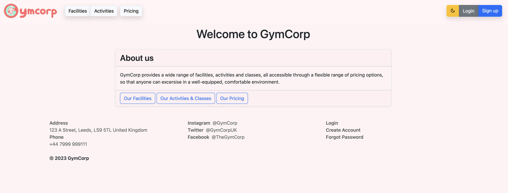

[](https://classroom.github.com/a/BsFdJ6lI)
# Gymcorp Management Website
-Developed in a team of 5 to create a gym management website for a local gym.

[Quick Run](#quick-run) | [Package & Run](#building) | [Docker](#docker)

## Quick Run
Note: Run with Python 3.9

1) Install Requirements:
```sh
$ pip install -r requirements.txt
```

2) Run launch script with populate flag (**first time only**):
```sh
$ python run.py --populate
```

3) Run normally:
```sh
$ python run.py
```
4) Access at https://localhost:5000 (Certificate is self-signed, so browser may require you to accept it. See [below](#usage) for a flag to disable SSL/TLS.)

## Building

1) Make sure [Poetry](https://python-poetry.org) is installed.
2) Open the venv shell:
```shell
$ poetry shell
```
3) Install dependencies:
```shell
$ poetry install
```
4) Build package:
```shell
$ poetry build
```

## Running
```shell
$ gymcorp
```
### Usage

Usage can be seen below:
```
$ gymcorp -h
usage: gymcorp [-h] [-d [DATABASE]] [--host HOST] [-p PORT] [--populate] [--production] [--nossl]
               [--ssl-cert SSL_CERT] [--ssl-key SSL_KEY]

gymcorp-website

options:
  -h, --help            show this help message and exit
  -d [DATABASE], --database [DATABASE]
                        Path to app database (default: None)
  --host HOST           address to host site on. (default: 0.0.0.0)
  -p PORT, --port PORT  port to host site on. (default: 5000)
  --populate            initialise database with default data. (default: False)
  --production          run with debug mode off. (default: False)
  --nossl               Run without SSL, to use with a reverse proxy or development. (default: False)
  --ssl-cert SSL_CERT   Path to SSL/TLS certificate to use. (default: None)
  --ssl-key SSL_KEY     Path to SSL/TLS key file to use. (default: None)
```

## Docker
### Building
```shell
docker build -t gymcorp-squad39 .
```
### Environment Variables
* `GYMCORP_DB_FILEPATH`: Path to database file. Remember this is within the container, so it should usually start with `/data/`.
* `GYMCORP_HOST`: The host address within the container.
* `GYMCORP_PORT`: The port within the container.
* `GYMCORP_POPULATE=1`: Setting this will populate the database with facility & activity data from the brief.
* `GYMCORP_NOSSL=1`: Disable SSL/TLS so that a reverse proxy can be used, or for debugging purposes.
* `GYMCORP_SSL_CERT`: Path to a custom SSL/TLS Certificate file.
* `GYMCORP_SSL_KEY`: Path to a custom SSL/TLS Key file.

### Running
**Optional**: If you need to pre-populate the database with facility & activity data, run the container with `GYMCORP_POPULATE` set to $1$:
```shell
$ docker run --rm -it -v <Database Folder Path>:/data -p 5000:5000 -e GYMCORP_POPULATE=1 gymcorp-squad39
```
1) Create the container:
```shell
$ docker create --name <Container Name> -v <Database Folder Path>:/data -p <Port>:5000 gymcorp-squad39
```
2) Run the container:
```shell
$ docker start <Container Name>
```
